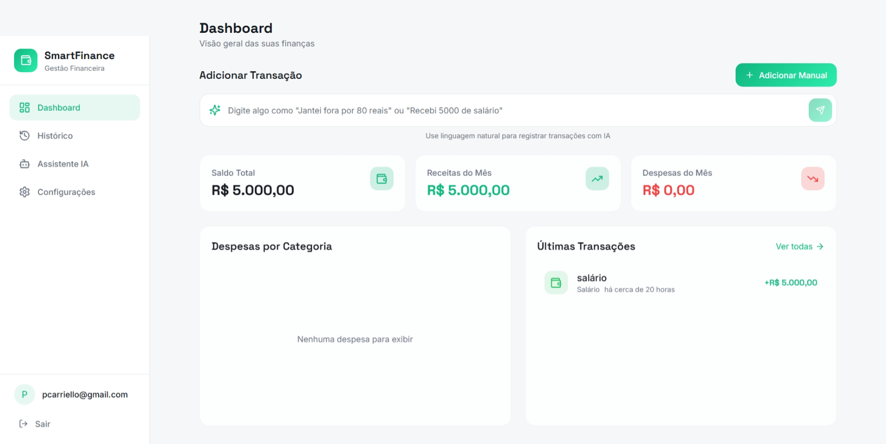

# 💸 SmartFinance - App de Organização de Finanças Pessoais com Vibe Coding

Projeto de web app feito com Vibe Coding como exercício para curso de GenAI da DIO + Caixa

## 🎯 Desafio

Problema: Muitas pessoas não conseguem manter um controle financeiro porque os aplicativos exigem muita entrada de dados manual, e a criação de orçamentos é vista como algo tedioso.

Precisamos de uma solução que permita **controlar as finanças por meio de uma conversa simples**, com **agentes de IA** capazes de criar **planos de economia personalizados e automatizados**. Você deve utilizar as ideias de **Vibe Coding** e **MVP (Produto Mínimo Viável)** para desenvolver o **conceito de um aplicativo** que resolva o problema citado.

## Prompt final (PRD - Product Requirements Document)

```markdown
# PRD - SmartFinance AI: Sistema de Gestão Financeira Pessoal

## 1. Visão Geral

Um aplicativo progressivo (PWA) focado em simplicidade, onde o utilizador gere as suas finanças através de entradas manuais rápidas ou comandos de texto interpretados por IA. O sistema requer autenticação e persistência de dados em nuvem.

## 2. Objetivos

- Centralizar receitas e despesas de forma intuitiva com segurança de acesso.
- Utilizar IA para categorização automática e insights financeiros a partir de texto.
- Garantir a integridade dos dados através de uma estrutura relacional.

## 3. Funcionalidades Principais

### 3.1. Autenticação (Login/Cadastro)

1. Criação de conta via E-mail/Senha ou Social Login.
2. Recuperação de senha e gestão de perfil básico.
3. Proteção de dados por utilizador (Row Level Security).

### 3.2. Dashboard de Resumo

- Cards com Saldo Total, Receitas Mensais e Despesas Mensais.
- Gráfico de distribuição de gastos por categoria.
- Feed das últimas transações sincronizadas em tempo real.

### 3.3. Registo de Transações (Manual & IA)

- **Entrada Manual:** Formulário com campos para Valor, Data, Categoria e Tipo.
- **Entrada via Texto (IA):** Campo de "Input Inteligente" que processa frases (ex: "Jantei fora por 80 reais") e salva automaticamente no banco como um registro estruturado.

### 3.4. Gestão de Categorias

- CRUD de categorias personalizadas vinculadas ao ID do utilizador.

### 3.5. Conselheiro Financeiro (IA)

- Interface de chat para análise de histórico e sugestões de economia baseadas nos dados reais da tabela de transações.

## 4. Requisitos Técnicos e Não Funcionais

- **Stack:** React (Frontend) + Supabase (Backend/Auth).
- **Banco de Dados:** PostgreSQL (Tabelas relacionais: users, categories, transactions).
- **Segurança:** Acesso restrito via JWT e regras de segurança de nível de linha (RLS).
- **UX/UI:** Design responsivo e suporte para Dark Mode.

## 5. User Stories

- Como utilizador, quero fazer login para que os meus dados financeiros estejam seguros e acessíveis em qualquer dispositivo.
- Como utilizador, quero digitar "Gasolina 50" e ter o registro salvo permanentemente na minha conta.
- Como utilizador, quero consultar a IA para saber quanto gastei em "Lazer" no mês passado.

## 6. Fluxo de Navegação

1. **Auth:** Login / Sign-up.
2. **Home:** Dashboard e resumo visual.
3. **Histórico:** Tabela detalhada de transações.
4. **IA Assistant:** Chat e input de texto.
5. **Settings:** Categorias e Logout.
```

## Link!

> [!IMPORTANT]
> O site criado está hospedado [aqui](https://smart-pocket-scribe.lovable.app/auth). 

## Print



## O que ele faz?

**SmartFinance AI** é um assistente de gestão financeira pessoal que centraliza o controle de receitas e despesas em uma plataforma intuitiva e segura. O aplicativo combina visualizações claras de desempenho, como o saldo atual e a distribuição de gastos por categoria em gráficos dinâmicos, com a facilidade de registrar transações via comandos de texto processados por inteligência artificial. Além do monitoramento em tempo real da atividade recente, o app oferece um assistente interativo capaz de fornecer insights personalizados e ajudar no planejamento financeiro diretamente pela tela principal.

## Conclusão

### O que funcionou bem

O Gemini foi utilizado para chegarmos em um bom PRD, e ele de fato foi muito bom para isso.
Além disso, utilizei o Lovable pela primeira vez e me impressionei com o quão robusta é a aplicação que ele consegue fazer.
Também aprendi como forkar um projeto do Lovable para o GitHub. Agora, o projeto está [nesse repositório](https://github.com/pecazeco/smart-pocket-scribe).

### O que não funcionou

Eu só consegui enviar 2 mensagens para o Lovable e já foi o suficiente para acabar os créditos. Com isso, a função de adicionar despezas pelo chat com IA não está funcionando e não foi possível resolver através de Vibe Coding.

### O que aprendi

O processo de Vibe Coding é muito útil para MVPs e prototipagem rápida, porém, você deve recorrer ao Loveble apenas quando você já definiu bem o produto e exauriu as opções gratuitas, já que os seus créditos acabam muito rápido e ele é caro.
